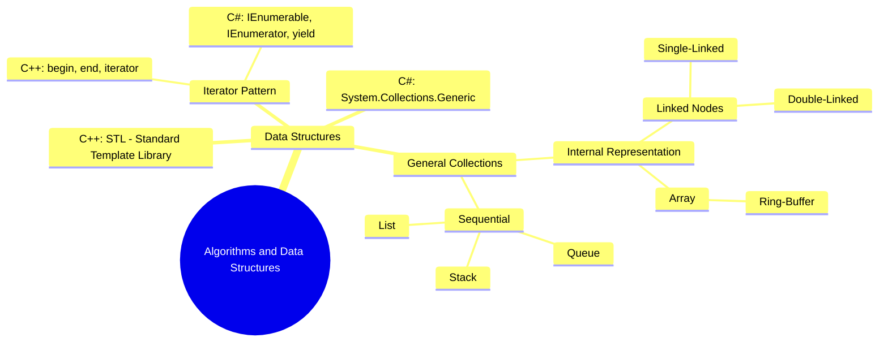

# 201 Collections

Hi, my name is Marc and I am an enthusiastic Software Developer and Lecturer.\
A lot of ⏱️ time and many years of iteration went into the preparation of this class material.\
Please Leave a ⭐️ on this repository if you found this course helpful!\
Feel free to open Issues for 💡 Feedback as well!

This material is available for free under the terms of [Creative Commons Attribution-NonCommercial-ShareAlike 4.0 International (CC BY-NC-SA 4.0)](https://creativecommons.org/licenses/by-nc-sa/4.0/deed.en). Check the `LICENSE` file on this repository for details.

---

## Introduction

Collections are used to store and group some variable number of data items that have some shared significance to the problem being solved and need to be operated upon together in some controlled fashion.

This module introduces you to a variety of collections that are used in several, most common contexts. As well as the `IEnumerable`-Interface, which allows easy iteration over your collection using `foreach`.

- [1 Collections](1-collections)
- [2 Iterator Pattern](2-iterator-pattern)
- [3 Linked Lists](3-linked-lists)
- [4 Stack](4-stack)
- [5 Queue](5-queue)
- [6 Complexity](6-complexity)
- [7 List (Dynamic Array)](7-list)
- [8 LINQ](8-linq)

## Passing Criteria
Implement either `TurboLinkedQueue` or `TurboLinkedList` including Unit Tests and the Demo Application.

## Excellent Criteria
On top of that, implement `TurboQueue` or `TurboList`, which internally uses an array for a buffer instead of a linked list.

## Learning Path

